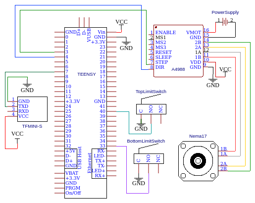

# Distance-Based Stepper Motor Control with ToF Sensor
This repository contains examples for controlling a stepper motor based on distance measurements from a Time-of-Flight (ToF) sensor. The goal is to maintain a constant reference distance from the ground while using emergency stop buttons to ensure safety.
The project uses serial communication for debugging and interaction and is designed to be modular for testing individual components like sensors, motors, and buttons.

## Overview
The project demonstrates how to interface and use a ToF sensor to measure the distance from a mounting point, and how to control a stepper motor to adjust its position so that it maintains a constant reference distance from the ground. These examples are modular, allowing you to test and integrate each component individually and together.

### Features
* __ToF Sensor Integration__: Interface with a ToF sensor to measure distance from the ground.
* __Stepper Motor Control__: Use a stepper motor to adjust the position of the object.
* __Push Button/Limit Switch Integration__: Implement emergency stop.
* __Serial Communication__: Monitor real-time data via serial communication.
* __ROS 2 Integration__: Enable advanced communication and control using ROS 2.

## Project Directory Structure
```plaintext
.
├── examples/
│   ├── motor_control/
│   │   ├── accelstepper_minimal_example
│   │   ├── accelstepper_motor_sensor
│   │   ├── limit_switch_accelstepper
│   │   ├── mk2_sensor_motor_minimal_example
│   │   ├── sensor_motor_minimal_example
│   │   └── stepper_minimal_example
│   ├── button/
│   │   ├── button_interrupt
│   │   ├── button_interrupt_check
│   │   ├── button_stop
│   │   └── limit_switch
│   ├── sensor/
│   │   ├── TOF_minimal_example
│   ├── communication/
│   │   ├── ros2_server
│   │   ├── send_serial_data
│   └── test_hw/
│       ├──tof_speed_mapping
│       ├──speed_mapping_accelstepper
│       ├──accelstepper_minimal_example
│       ├──minimal_example_serial_motor
│       └──hw_test6
├── wiring_diagrams/
│   └── DistanceControl-WICON.png
├── README.md
```
## Installation
 1. Clone the repository:
```
git clone https://github.com/Sohampaul7/Work.git
cd Work

```
2. Install the required library:
    * AccelStepper (for stepper motor control)


3. Open the desired example from the `examples/` folder. Upload it to your microcontroller.

## Usage
### Suggested Workflow
1. **Test the ToF Sensor:** Begin with the `TOF_minimal_example` to ensure the Time-of-Flight (ToF) sensor is reading distances correctly.
2. **Test motor movement:** Use `accelstepper_minimal_example`.
3. **Integrate Sensor and Motor:** Combine ToF sensor feedback with stepper motor control with `mk2_sensor_motor_minimal_example`.
4. **Implement emergency stop:** Use `button_interrupt` or `button_stop`.
5. **Enable Serial Communication:** Use `send_serial_data` to transmit sensor and motor data via serial communication.
6. **Integrate and test everything:** Test integration of limit switch with serial communication using `limit_switch_accelstepper`.
7. **Add ROS 2 Support:** Experiment with `ros2_server` to integrate the setup with ROS 2 for advanced communication and control.

## Examples Overview
| Example  | Purpose | Dependencies |
| ------------- |:-------------:| :-------------:|
| `TOF_minimal_example` | Test ToF sensor functionality and measure distances. | TFMini-S Sensor
| `accelstepper_minimal_example`| Basic stepper motor control with AccelStepper library.|AccelStepper Library
| `mk2_sensor_motor_minimal_example`| Integrates ToF sensor readings with stepper motor positioning. |AccelStepper, TFMini-S
| `button_interrupt`| Emergency stop using push buttons with interrupts.|Push Buttons
| `send_serial_data`| Send ToF sensor and motor data via serial communication.|Serial Communication Tools
| `limit_switch_accelstepper`| Combines motor control, sensor feedback, and emergency stop.|AccelStepper, TFMini-S, Push Buttons, Serial communication
| `ros2_server` | ROS 2 integration for real-time motor and sensor control.|ROS 2 Environment

## Wiring diagram

The wiring diagram for the distance control system is shown below:



## Contributing
Feel free to contribute to the project by submitting pull requests. If you find any bugs or have suggestions for improvements, open an issue, and I’ll be happy to review it.

## Authors and acknowledgment
### Authors
- **Soham Paul**  
  Primary author of the code. Responsible for designing, implementing, and testing the core functionality.

### Acknowledgments
- **Eric Schoneberg**  
  Provided valuable guidance and insights during the development process.
- **Riyan Cyriac Jose**  
  Suggested optimizations for better performance and provided guidance throughout the project.

